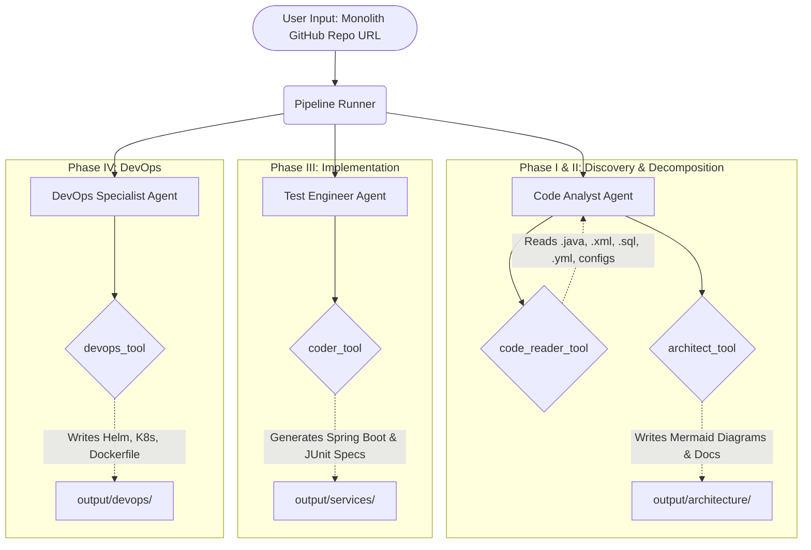

# 🏗️ MonoToMicro (M2M) Agent

> Modular, extensible Google ADK Multi-Agent System for automating Java monolith → microservices migrations via the Strangler Fig pattern.

---

## 📖 Project Overview

The **MonoToMicro (M2M) Agent** is an end-to-end, multi-agent AI pipeline designed to intelligently tear down monolithic applications and scaffold modern, cloud-native microservices architectures. 

Instead of relying on rigid static analysis, this agent cluster leverages LLMs to deeply understand the codebase functionally and holistically. It scans the entire project context (not just `.java` source files, but also `.xml`, `.properties`, `.yml`, `.sql`, and `.md` configs) to generate realistic Domain-Driven Design (DDD) boundaries.

It outputs actionable architecture artifacts (detailed Mermaids diagrams, executive summaries, proposed migration phases) and then physically scaffolds the new Spring Boot microservices, JUnit tests, and Kubernetes/Helm deployments.

---

## 🏗️ High-Level Architecture

The M2M pipeline operates sequentially across four distinct phases using specialized sub-agents:



### Agents & Phases:
1. **🔬 Code Analyst Agent (Phases I & II):** Fetches the repository using `code_reader_tool`. Evaluates the whole application structure to extract Coupling Hotspots, God Classes, and Bounded Contexts. Employs `architect_tool` to generate a comprehensive `README_DECOMPOSITION.md` and detailed System Context, Low-Level/High-Level Class, and Sequence `.mmd` diagrams.
2. **⚙️ Test Engineer Agent (Phase III):** Re-evaluates the proposed boundaries and utilizes `coder_tool` to physically generate the new Java 21/Spring Boot 3 source files, `pom.xml` dependencies, and rigorous test coverage.
3. **🚀 DevOps Specialist Agent (Phase IV):** Uses `devops_tool` to convert the generated microservices into deployment-ready assets, crafting Multi-stage Dockerfiles, Helm Charts, HPA configurations, and Kubernetes manifests.

---

## 📂 Package Structure

```
mono-to-micro-agent/
│
├── config/
│   └── settings.py          # Pydantic BaseSettings — Single source of truth for env vars
│
├── models/
│   └── schemas.py           # All Pydantic I/O contracts. Contains BoundedContext, ArchitectInput, etc.
│
├── utils/
│   ├── logger.py            # Structured logging implementation
│   ├── java_codegen.py      # Spring Boot / JUnit source templates
│   └── k8s_codegen.py       # Dockerfile / Helm / K8s YAML templates
│
├── tools/
│   ├── code_reader.py       # Extensively reads .java, .xml, .yml, .sql, .md from target repo
│   ├── architect.py         # Persists DDD domains, Mermaid diagrams (Context/Class/Sequence), and Docs
│   ├── coder.py             # Spring Boot microservice code generation & JUnit scaffolding
│   └── devops.py            # Infrastructure-as-code generator (Dockerfile + Helm + K8s manifests)
│
├── prompts/
│   ├── master.py            # Shared foundational system context & rules
│   ├── analyst.py           # Phase I + II: Code discovery & architecture generation prompt
│   ├── test_engineer.py     # Phase III: Java and Tests implementation prompt
│   └── devops.py            # Phase IV: DevOps configuration prompt
│
├── agents/
│   ├── base.py              # AgentFactory — Wrapper for instantiating ADK agents
│   ├── analyst_agent.py     # Sub-agent: CodeAnalystAgent (Phase I + II)
│   ├── test_engineer_agent.py # Sub-agent: TestEngineerAgent (Phase III)
│   └── devops_agent.py      # Sub-agent: DevOpsSpecialistAgent (Phase IV)
│
├── orchestrator/
│   └── pipeline.py          # Links sub-agents linearly into a SequentialAgent flow
│
├── runner/
│   ├── session.py           # State management & Session saving backend
│   └── pipeline_runner.py   # ADK PipelineRunner — Orchestrates event loops and error reporting
│
├── output/                  # (Generated at run-time) Contains LLM outputs
│   ├── architecture/        # Mermaid diagrams, Context, and Markdown files
│   ├── devops/              # Helm charts and manifests
│   └── services/            # Extracted microservice source code
│
├── tests/
│   └── test_tools.py        # Pytest sanity checks for tools
│
├── main.py                  # Primary CLI application entry point
├── requirements.txt         # Dependencies
└── .env                     # Local environment configuration file
```

---

## ⚡ Quick Start

1. Install dependencies:
```bash
pip install -r requirements.txt
```

2. Create an `.env` file in the root directory and populate it:
```env
# Your Google Vertex AI or Gemini Studio API Key
GOOGLE_API_KEY=your_gemini_api_key

# (Optional) If using Vertex AI instead of Google AI Studio
GOOGLE_GENAI_USE_VERTEXAI=false
GOOGLE_CLOUD_PROJECT=your_gcp_project_id
GOOGLE_CLOUD_LOCATION=us-central1

# Default Model Selection
DEFAULT_MODEL=gemini-3-flash-preview

# GitHub Personal Access Token (PAT) for analyzing private repos
GITHUB_TOKEN=your_github_pat
```

3. Run the pipeline against your target monolith:
```bash
python main.py https://github.com/your-org/legacy-banking-monolith
```

Run tests (no ADK runtime needed):
```bash
pytest tests/ -v
```

---

## Extension Recipes

### Add a new agent (e.g. Security Scanner)

**1. Create the prompt** — `prompts/security_scanner.py`
```python
SECURITY_SCANNER_PROMPT = "You are a security specialist. Scan for OWASP Top 10..."
```

**2. Create the tool** — `tools/security_scanner.py`
```python
def security_scanner_tool(source_files: dict) -> dict:
    ...
```
Register in `tools/__init__.py`:
```python
from .security_scanner import security_scanner_tool
security_scanner_fn_tool = FunctionTool(func=security_scanner_tool)
```

**3. Create the agent** — `agents/security_scanner_agent.py`
```python
from mono_to_micro_agent.agents.base import AgentFactory
from mono_to_micro_agent.prompts.security_scanner import SECURITY_SCANNER_PROMPT
from mono_to_micro_agent.tools import security_scanner_fn_tool

security_scanner_agent = AgentFactory.create(
    name="SecurityScannerAgent",
    instruction=SECURITY_SCANNER_PROMPT,
    tools=[security_scanner_fn_tool],
    output_key="security_result",
)
```

**4. Register in the pipeline** — `orchestrator/pipeline.py`
```python
from mono_to_micro_agent.agents.security_scanner_agent import security_scanner_agent

_PIPELINE_AGENTS = [
    analyst_agent,
    test_engineer_agent,
    devops_agent,
    security_scanner_agent,   # ← append here
]
```

That's it. No other files change.

---

### Swap the LLM model

In `.env`:
```
DEFAULT_MODEL=gemini-1.5-pro-002
```
All agents pick up the change via `get_settings()` — no code changes.

### Switch to Vertex AI

In `.env`:
```
GOOGLE_GENAI_USE_VERTEXAI=true
GOOGLE_CLOUD_PROJECT=your-project
GOOGLE_CLOUD_LOCATION=us-central1
```

### Swap session backend (e.g., Firestore)

Edit `runner/session.py` only — replace `InMemorySessionService` with
`FirestoreSessionService`. Nothing else changes.

---

## 🛡️ Module Responsibilities (Single Responsibility Principle)

The project heavily adheres to the core tenets of software engineering, separating concerns into strict boundaries:

| Module | Core Responsibility ✅ | What it STRICTLY Avoids ❌ |
|--------|------------------------|---------------------------|
| `config/settings.py` | Load and parse environment variables (`.env`) | Touching ADK agents or executing tools |
| `models/schemas.py` | Define strict static shapes for AI data flows to prevent hallucinations | Holding business/pipeline logic |
| `utils/*_codegen.py` | Render String templates for Java and Kubernetes | Making HTTP REST API or LLM calls |
| `tools/*.py` | Orchestrate Input/Output functions available to LLMs | Wrapping or defining Prompt text |
| `prompts/*.py` | Define rigid Agent character profiles, heuristics, and directives | Containing internal Python application logic |
| `agents/*.py` | Abstract `AgentFactory` to configure LLM tools, models, and boundaries | Defining low-level tool logic or complex orchestrations |
| `orchestrator/pipeline.py`| Stitch specialized agents sequentially into a meta-agent pipeline | Executing the Application event loop |
| `runner/pipeline_runner.py`| Kick off ADK execution threads, maintain streaming context across phases | Building agents or declaring Tools |
| `main.py` | Command-Line-Interface argument ingestion (`argparse`), `asyncio` boot | Pipeline or Tool Implementation logic |